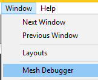
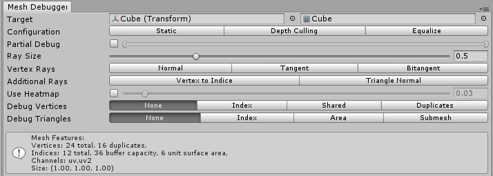
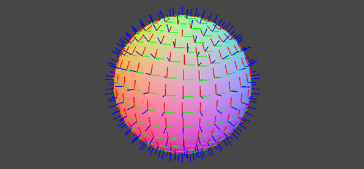
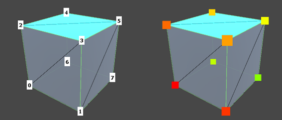

# Manual (v0.9.x)

After importing the plugin to your project, you can open Mesh Debugger window to start inspecting any selected object.

## Selecting Object to Inspect

The first row shows which object and mesh that currently being inspected. It will be automatically updated to active (selected) object in the scene, then looking for a Mesh containing in either `MeshFilter` (3D), `SkinnedMeshRenderer` (as Static Snapshot) or `Graphic` (UI).

Note that to be able to inspect a mesh, you need to make sure that the [mesh is readable](https://docs.unity3d.com/Manual/class-Mesh.html#:~:text=and%20Z%20directions.-,Read/Write%20Enabled,-The%20value%20of).

> Until this version you can't lock the selected mesh and there's no plan for supporting multiple inspection in the same time.

## Configurations

+ `Static`: Turn this on if currently inspected mesh won't change over time.
+ `Depth Culling`: Reduce complexity by enable Z-Depth on visual cues.
+ `Equalize`: Keep visual cues scale equally in Screen Space (requires `Static` turned off).
+ `Partial Debug`: Only inspect vertex/triangle at selected fraction.

## Rays

For displaying vector values like normal direction:

+ `Ray Size`: Size of the ray.
+ `Vertex Rays`: Show Normal/Tangent/Bitangent of each vertex.
+ `Additional Rays`: Show Vertex to Triangle ray and Normal direction of each Triangle.

## Heatmap

Heatmap is used displaying scalar values like vertex index.

+ `Use Heatmap`: Display scalar value as number (image on left) or color indicator (image on right).
+ `Debug Vertices` Displays:
  - `Index`: Index of each vertex
  - `Shared`: How many triangles reference that vertex (useful for detecting orphaned vertices)
  - `Duplicated`: How many vertices have the same position
+ `Debug Triangles` Displays:
  - `Index`: Index of each triangle
  - `Area`: Calculated area surface of each triangle
  - `Submesh`: Submesh index of each triangle
+ `Debug Surface` Modifies object material temporarily to displays:
  - `Facing`: Triangle facing (useful for detecting flipped normals)
  - `Color`: Viewing Color Channel
  - `UV`: Viewing selected UV Channel (red-green for X,Y vector)
  - `Tangents`: Viewing selected Tangent vector in Color

  \* `Debug Surface` Only supports mesh from `MeshFilter` at this point.

## Mesh Features Info

In near bottom in the Window there are read-only statistics about the inspected mesh including vertex count, indices, vertex channels, and many more.

We also open to discuss about what's info else should be included here.
