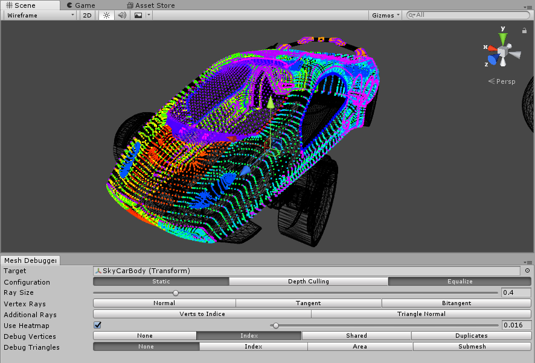

# MeshDebugger v0.9

MeshDebugger is an editor tool to visually inspect a mesh. Very helpful if you want to debug your procedurally generated mesh or inspecting ideal parts of your model.

## Download + Manual

**Download the plugin via [Releases](https://github.com/willnode/MeshDebugger/releases/latest) or [Asset Store](//u3d.as/Qsd)**.

See **[Usage Instruction Here](INSTRUCTIONS.md)**.

## Features

+ Super simple (Just open the window and select a GameObject)
+ Dynamic update everytime scene repaint (can be turned off for speed)
+ Depth Culling (Reduces visual complexity) and/or only Inspect by fraction part.
+ Inspect static mesh with over 65K vertices without lag (and yes, it don't have to be Unity 2017.3 to use it)
+ Many visual choices: Rays (normal/tangent/bitangent), Heatmap or Numbered GUI (triangle/vert index and other properties), Surface Shading (triangle facing, vertex uv and color), etc.
+ Support uGUI (Unity UI) and SkinnedMeshRenderer with no additional setup.

## Technology

MeshDebugger does this in simple order:

1. Get complete mesh analytics info
2. Draw debug info to a mesh (can be splitted to several mesh if over 65K vert get added)
3. Render it all-at-once via `Graphic.DrawMeshNow()`.

## Runtime Inspect

Because MeshDebugger don't use `Gizmos` or `Handles`, it's possible to bring inspection into runtime build, although it still need several modification because this is editor-oriented tool.

If enough people interested I can make separate repo for [IMGizmos](Assets\Plugins\MeshDebugger\Editor\IMGizmos.cs) which makes this Immediate Drawing wonderfully simpler and fast.

## License

[MIT](LICENSE)
